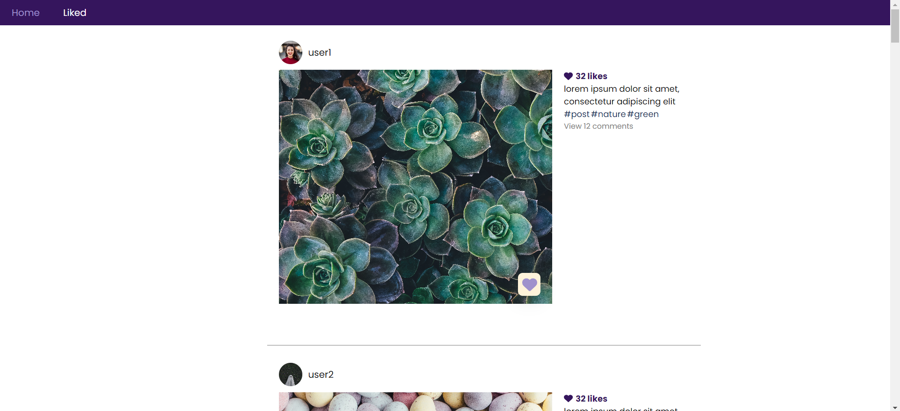
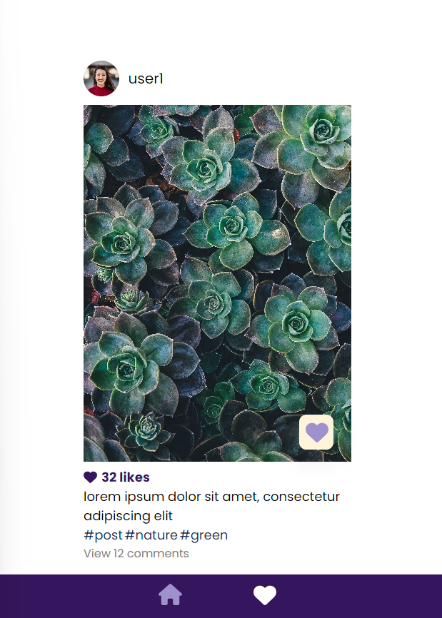
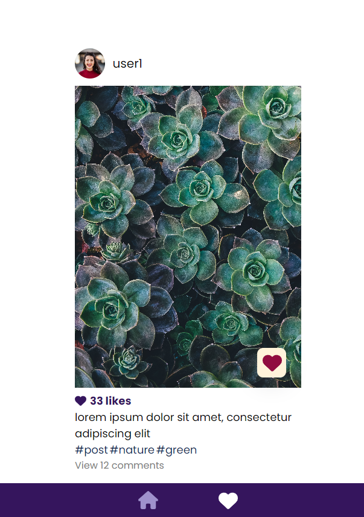
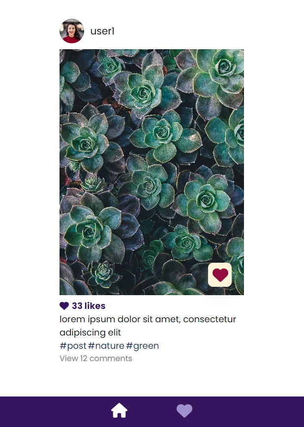
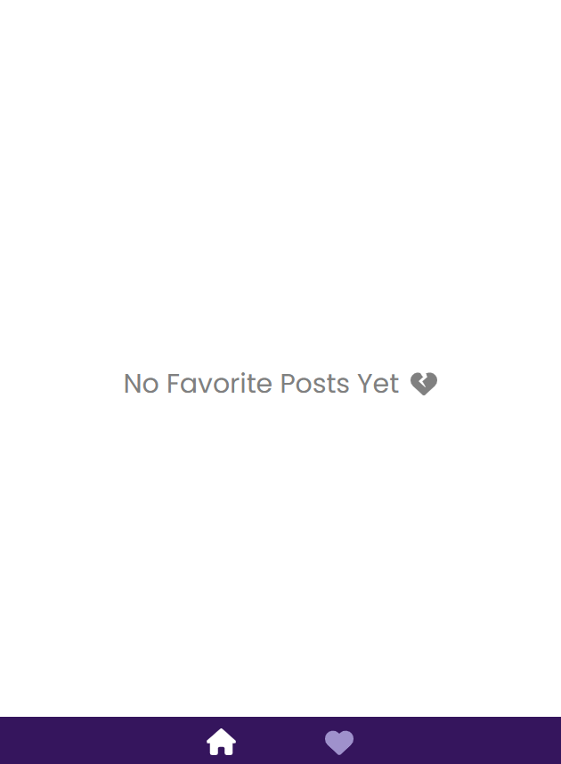
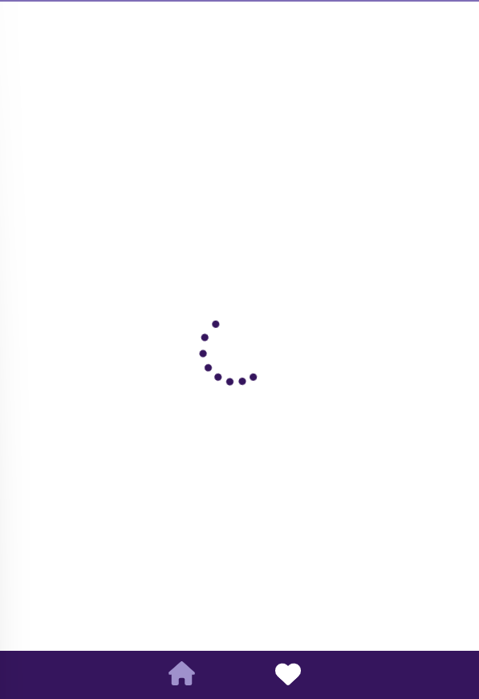

# Posts App

This is a simple blog app built with Next.js, it has the following features:

1. Shows list of all posts
2. The user can add some of the posts to their favorite lists
   and remove them from there as well

## Getting Started

First, install all the packages

```bash
npm install

```

Second, run the development server:

```bash
npm run dev

```

Open [http://localhost:3000](http://localhost:3000) with your browser to see the result.

## Tools used in this project

**Styling:** Sass </br>
**Icons:** Font Awesome

## Screen shots from the app

Desktop version of the Home page where all the posts are listed </br>

</br>Mobile version of the Home Page </br>

</br>When the user clicks on the heart icon, the heart gets highlighted and the number of likes increases </br>

</br>The user can view there favourite posts on /favorite route by clicking on the heart icon on the navbar (mobile) or Liked (desktop)</br>

</br>If there is no liked posts, this view will be displayed to the user </br>

</br>A spinner is displayed when the content is still loading</br>

